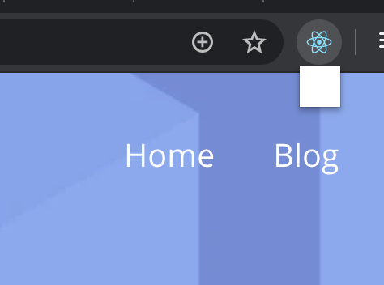

# ReactでChrome拡張機能をビルドする方法を模索する

Chrome拡張機能をReactベースで開発することで、快適な環境を整えたい。。。

## 背景

Chrome拡張機能とはChromeブラウザに対して、機能を付け足したり機能を強化することができる仕組みです。  
普段は`Javascript`や`HTML`, `CSS`のみで構成され、簡単にブラウザの拡張機能を作ることができます。  

- 簡単な`Javscript`, `HTML`, `CSS`の知識があれば開発可能
- ユーザー登録料500円で20のアプリをデプロイ可能で、非常に安価

と、以上のことから成果物が出来やすくプログラミング初学者の学習に最適だと私は感じています(作ってみると[意外と便利](https://chrome.google.com/webstore/detail/wipeyy-controllable-pictu/mgbnhohohiggdomiccdpkhaponabbfbc?hl=ja&authuser=2)だったりしますしね)  。

一方で、Chrome拡張機能を開発する上では拡張機能独自の機能を利用したり、制限の中で開発する必要があるほか、Javascriptを用いてDOMを操作する必要が生じるため、一朝一夕にはうまくいかないものです。  

特に現在閲覧しているWebページに対して拡張機能を通して`別の表示をする`場合などにはDOM自体を正確に制御する必要がありそれがなかなか難しいものです。  

そこでReactやVueなどの仮想DOMを用いることで非常に簡単に操作してみたいと考えます。  


## Reactアプリの導入

まず任意のディレクトリを作成して、Reactアプリを生成します。  
Reactのアプリは`npx`を用いて簡単にテンプレートの生成を行うことが可能です。  

```bash  
npx create-react-app extension_app  
```  

生成された`extension_app`ディレクトリに移動し、ビルドのために環境変数のセットをします。

`.env`ファイルをReactアプリのルートディレクトリに作成し、以下のように記入します。

```bash
# /.env
NODE_ENV=development
PUBLIC_URL=./ # こう指定することでリソースを読み込む際に絶対パスにならないようにしている
```


そしてReactアプリをビルドします。  

```  
yarn build (or npm run build)  
```  

すると`build`ディレクトリが生成されるので、`build/index.html`をブラウザで開きます。  
するとReactのページが表示されうまくビルドが完了しているかと思います。  

## 拡張機能への第一歩

Chrome拡張機能を開発する上でもっとも重要になるのが`manifest.json`の存在です。  
拡張機能の役割や詳細な情報は`manifest.json`によりブラウザに認識させ、ブラウザは拡張機能としてパッケージを読み込みます。  

`public/manifest.json`を以下のように編集してみます。  

```  
{
  "manifest_version": 2,  
  "name": "React Chrome Extension",  
  "version": "0.0.1",  
  "browser_action": {  
    "default_icon": "logo192.png",  
    "default_popup": "index.html"  
  },  
  "content_security_policy": "script-src 'self' 'sha256-GgRxrVOKNdB4LrRsVPDSbzvfdV4UqglmviH9GoBJ5jk='; object-src 'self'"  
}
```  
そして再び`yarn build`として、ビルドが完了したら`chrome://extensions/`にアクセスしてビルドした拡張機能を読み込ませます。  

> 画面右上の`デベロッパーモード`がONになっているか確認し、`パッケージ化されていない拡張機能を読み込む (en: Load unpacked)`をクリックして、ビルドしたファイルを選択します。
> 


> 読み込みに成功すると、このようなアイコンがブラウザの検索バーの横に表示されるはず。
> クリックしてみると、アイコンのしたに小さな四角が表示されるはず。
> 
> 

ここで、`chrome://extensions/`を確認すると以下のようなエラーが生じていることが確認できるはずです。

> `Refused to execute inline script because it violates the following Content Security Policy directive: "script-src 'self' 'sha256-GgRxrVOKNdB4LrRsVPDSbzvfdV4UqglmviH9GoBJ5jk='". Either the 'unsafe-inline' keyword, a hash ('sha256-AjUuJeeaGXOZRM9RXidP3k4H7oX6F1k/FrnY63p+lJc='), or a nonce ('nonce-...') is required to enable inline execution.`


Reactアプリはデフォルトで、実行中に小さなランタイムスクリプトを`index.html`に埋め込みます。  
これはHTTPリクエストの数を減らすためなのですが、Chrome拡張機能ではCSPに違反するためエラーが生じてしまします。  
これを回避するためにビルド時の設定を変更します。  
そして、`packege.json`のscriptsに次のように記述を変更します  

```json  
 // "build": "react-scripts build",  
"build": "INLINE_RUNTIME_CHUNK=false react-scripts build",  
```  

これができたら`yarn build`として生成した`build`をChrome拡張機能に読み込ませます。  
表示されたアイコンをクリックするとreactのアプリが表示されるはずです！  
これで拡張機能の`popup`をReactを使って作ることができました。  

> Reactのトップ画面がアイコンをクリックすることで表示されるようになる 
> 
> 

## 閲覧ページ上で動作するChrome拡張を作成する

前節までで、ポップアップページを作成するとこに成功しました。  
Chrome拡張機能には3つのページの概念が存在します。  

- ポップアップページ (`js, html`)
  - 拡張機能のアイコンをクリックして表示せるページ
  - このページ内で操作を行う
- バックグラウンドページ (`background.js`)
  - ブラウザを起動した瞬間から実行が始まるページ
  - ユーザーには見えない部分で実行され`Chrome API`を呼び出したりできる
- コンテンツスクリプト (`content.js`)
  - ユーザーが閲覧しているページに変更を加えるためのスクリプト
  - 閲覧しているサイトにDOMを追加したり書き換えたり、操作することが可能
  - ポリシーの制限も厳しく全てやれるわけではない
  - [Content Scripts - Google Chrome](https://developer.chrome.com/extensions/content_scripts)

先ほどビルドしたReactアプリは`index.html`をエントリーポイントとして、それ以外のJSファイルはビルドするたびにファイル名が変更されてしまいます。

`index.html`を用いたChrome拡張機能だと基本的に`popup page`のみでしか動作しない上、毎回変更されるファイルの名前を`manifest.json`に記述する必要があり、面倒なことになります。  
これは`create-react-app`でReactアプリを生成している為で、内蔵されたwebpackにより容易に変更することはできません。  

この回避策として、`yarn run eject`を用いる方法があります。  
`yarn run eject`を用いることで`create-react-app`の管理から抜け出してnode_modules以下に必要なモジュールが全てインストールされ、単独でビルド可能になります。  

### コンテンツスクリプトを作成する

ユーザーが閲覧しているページに変更するためにコンテンツスクリプトを作成します。

```
touch src/content.js
```

作成した`content.js`に以下の内容を記述します。

```javascript
import React from 'react';
import ReactDOM from 'react-dom';
import './index.css';
import App from './App';

const app = document.createElement('div');
app.id = "my-extension-root";
document.body.appendChild(app);

ReactDOM.render(<App />, document.getElementById(app.id));
```

また、`index.css`に以下の内容を追記します。

```css
/* src/index.css */
#my-extension-root {
  width: 400px;
  height: 100%;
  position: fixed;
  top: 0px;
  right: 0px;
  z-index: 2147483647;
  background-color: white;
  box-shadow: 0px 0px 5px #0000009e;
}
```

`index.js`は全てコメントアウトしてしまいます。  


### Reactのビルド設定を変更する

Webの表示を変更するスクリプトを作成したので次にビルド設定を変更します。  

まず、gitでcommitしてから`yarn run eject`を実行し`yarn install`を実行します。  
すると新たに`/config`と`/scripts`のフォルダが生成され、14個程度のファイルが出来てると思います。  
この中の`/config/webpack.config.js`を編集することでReactアプリのビルド設定を細かく変更することが可能です。
試しに、以下のように変更を加えてみます。適当に`key`で検索して該当箇所を変更してみてくだださい。

```javascript
// 変更前 /config/webpack.config.js
entry: [
  // Include an alternative client for WebpackDevServer. A client's job is to
  // connect to WebpackDevServer by a socket and get notified about changes.
  // When you save a file, the client will either apply hot updates (in case
  // of CSS changes), or refresh the page (in case of JS changes). When you
  // make a syntax error, this client will display a syntax error overlay.
  // Note: instead of the default WebpackDevServer client, we use a custom one
  // to bring better experience for Create React App users. You can replace
  // the line below with these two lines if you prefer the stock client:
  // require.resolve('webpack-dev-server/client') + '?/',
  // require.resolve('webpack/hot/dev-server'),
  isEnvDevelopment &&
    require.resolve('react-dev-utils/webpackHotDevClient'),
  // Finally, this is your app's code:
  paths.appIndexJs,
  // We include the app code last so that if there is a runtime error during
  // initialization, it doesn't blow up the WebpackDevServer client, and
  // changing JS code would still trigger a refresh.
].filter(Boolean),

// 変更後
entry: { // このentryオブジェクトの中身を変更する
  main: [paths.appIndexJs],
  content: ['./src/content.js']
},
```

```javascript
// 変更前 /config/webpack.config.js
// Keep the runtime chunk separated to enable long term caching
// https://twitter.com/wSokra/status/969679223278505985
// https://github.com/facebook/create-react-app/issues/5358
runtimeChunk: {
  name: entrypoint => `runtime-${entrypoint.name}`,
},

// 変更後 /config/webpack.config.js
runtimeChunk: false // オブジェクトをfalseに変更
```

> [Make extension compatible with Create React App v2.x · Issue #2 · satendra02/react-chrome-extension · GitHub](https://github.com/satendra02/react-chrome-extension/issues/2#issuecomment-559533252)

webpackはデフォルトでビルドする際に出力するファイル名にハッシュ(リビジョン)を付与します。  
これはファイル名をビルドするごとに変化させることで、ブラウザがキャッシュを読み込んで変更が反映されない問題を回避するためだそうです。
> [webpack@4 で出力するファイルをリビジョン管理する](https://numb86-tech.hatenablog.com/entry/2018/11/03/122201)

Chrome拡張機能では`content_script page`や`background page`などそれぞれのページで読み込むファイルを`manifest.json`で定義する必要があります。
ビルドするたびにファイル名が変更される状態では毎回`manifest.json`を書き換える必要が生じてかなりの手間になります。

そこでハッシュが付与されないように`config/webpack.config.js`内の`.[contenthash:8]`や`.[hash:8]`を検索して削除します。


```javascript
  // Example....

  //  'static/js/[name].[contenthash:8].js'
  'static/js/[name].js'
  // 中略 
  {
    // name: 'static/media/[name].[hash:8].[ext]'
    name: 'static/media/[name].[ext]'
  }
```

さらに、`0.chunk.js`や`2.chunk.js`といった命名で`chank.js`も生成されますが、これも数字が割り当てられないように変更を加えます。

```javascript
/* config/webpack.config.js */

// chunkFilename: isEnvProduction
//         ? 'static/js/[name].chunk.js'
//         : isEnvDevelopment && 'static/js/[name].chunk.js',
chunkFilename: isEnvProduction
        ? 'static/js/chunk.js'
        : isEnvDevelopment && 'static/js/chunk.js',
```


こうすることで、ハッシュが付与されなくなるので、ビルドしたら直ぐにChrome拡張機能に変更を反映することができます。

そして`yarn build`を実行します。  
するとちゃんとビルドが完了し、`/build/static/js/`以下のディレクトリに`content.js`や`main.js`, `chanck.js`などが生成されていると思います。


ブラウザで拡張機能を読み込んだらちゃんと出来ているはずです

### manifest.jsonを変更する

前節までで、ビルドは上手く行きましたが`manifest.json`を変更していないため正しくファイルを読み込むことは出来ません。

そこで`manifest.json`に以下を追記します

```json
  "content_scripts" : [
    {
      "matches": [ "<all_urls>" ],
      "css": ["/static/css/content.css"],
      "js": ["/static/js/chunk.js", "/static/js/content.js", "/static/js/main.js"]
    }
  ],
```

そしてビルドを行えば、ブラウザに写真のような表示が出るようになるはずです。

> 

ここでロゴがちゃんと表示されていないかと思いますが、これはchrome拡張機能のディレクトリ構造について理解する必要がありますが、面倒なので修正点のみを以下に示しす。

### ロゴを表示できるようにする(リソースを読み込めるようにする)

- `manifest.json`に以下を追記

```json
  "web_accessible_resources": [ "static/*.*"]
```

- `libs`フォルダとその中に`libs/extensionService.js`を作成して以下のスクリプトを作成

```javascript
/*global chrome */ // <- eslintのエラー回避のため

/**
 * Browser specific functions
 */
const ExtensionService = {
  getResourceUrl: function(resourceName) {
      //console.log("getResourceUrl", resourceName);
      return chrome.extension.getURL.apply(chrome, arguments);
  }
};

export default ExtensionService;
```
- `App.js`で`extensionService`を読み込み、`logo`のパスをいい感じにする

```javascript
/* App.js */
import React from 'react';
import logo from './logo.svg';
import ExtensionService from './libs/extensionService' // exetnsionServiceをインポート
import './App.css';

function App() {
  return (
    <div className="App">
      <header className="App-header">
        <!-- getResourceUrlでpathを解決する -->
        
        <p>
          Edit <code>src/App.js</code> and save to reload.
        </p>
        <a
          className="App-link"
          href="https://reactjs.org"
          target="_blank"
          rel="noopener noreferrer"
        >
          Learn React
        </a>
      </header>
    </div>
  );
}

export default App;
```

これでビルドすれば完成😎

> 

 
> 参考文献  
> `/config/webpack.config.js`あたりの話で参考になった  
>  [Create chrome extension with ReactJs using inject page strategy](https://itnext.io/create-chrome-extension-with-reactjs-using-inject-page-strategy-137650de1f39)  
> [Make extension compatible with Create React App v2.x · Issue #2 · satendra02/react-chrome-extension · GitHub](https://github.com/satendra02/react-chrome-extension/issues/2#issuecomment-559533252)